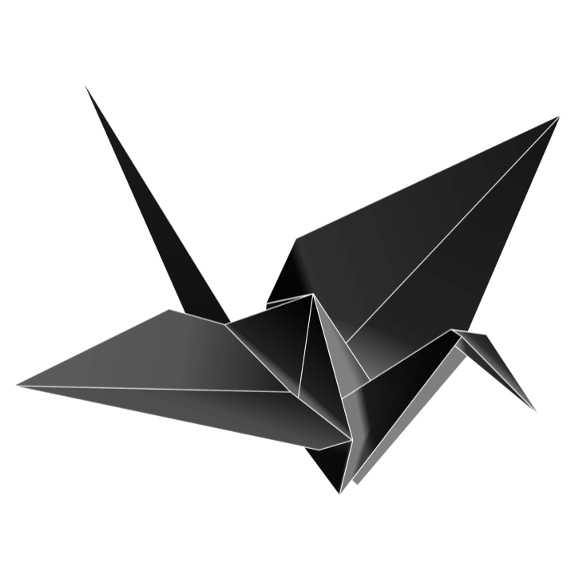

# The Evalate Programming Language
Evalate is an open-source simple programming language inspired by the likes of [C++](https://isocpp.org) and [Carbon](https://github.com/carbon-language/carbon-lang). It is written in C++ and is currently in an early development position. Evalate aims to be more geared towards already existing C++ developers to make writing code a little bit easier.

## Code Example
This file: ``examples/hello.evl``
```cpp
include std;

// Something else to note: Evalate is backwards-compatable with all C++ header files. See examples/headers.evl.

fn int main() {
    std.println("hello world");
}
```

This file: ``examples/headers.evl``
```cpp
// Import from a C++ header file:

include cpp "/usr/include/iostream"

fn int main() {
    string text = "text here";

    extern cpp fn void println(text) {
        // Any code put here will be handed to a C++ compiler
        // Any arguments will be defined as C++ variables

        std::cout << text << std::endl;
    }

    return 0;
}
```

## License
Evalate is licensed under the MIT License.
